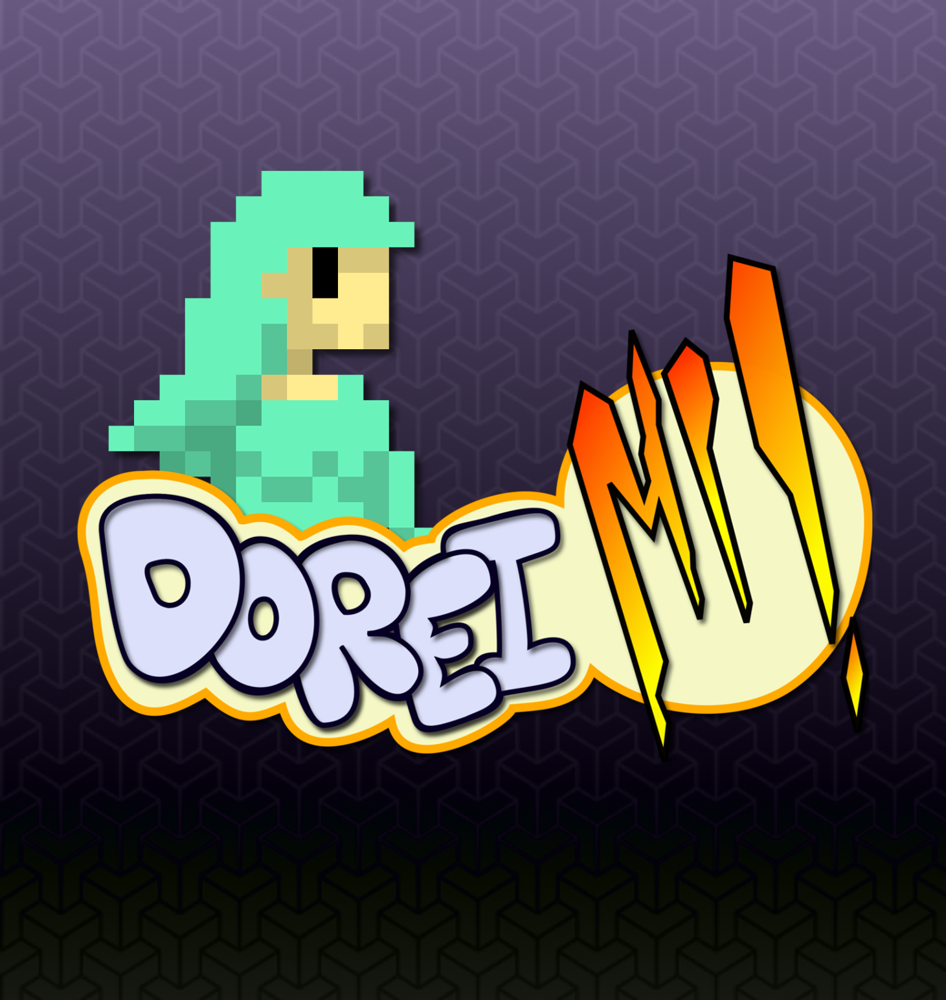
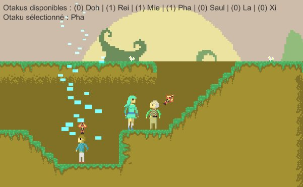

# Doreimi

### Puzzle game en 2D

Ce projet a étè réalisé dans le cadre d'un cours de conception de jeux. 
Lors de ce projet j'était en charge du design et de l'implémentation des tableaux, de la réalisation des assets graphiques, ainsi que de implémentation de 4 personnages.
Le projets a étè développé sous Unity 3D sur une période d'un mois, divisée en 4 sprints scrum.

Dans ce jeu le joueur incarne Yhdol, une chanteuse japonnaise, perdu dans la forêt canadienne. Pour faire son chemin à travers les tableaux le joueur doit utilisé les différentes capacitées des fans accompagnant Yhdol.

[Home](../index.html)

