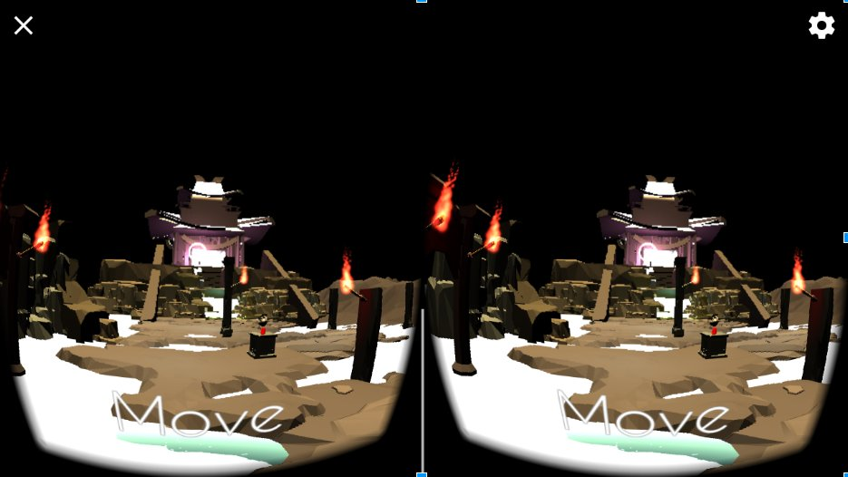

# Sweet Spine

### Un jeu sérieux en VR sous Android

## Le jeu

Ce projet a étè développé au Centre pour la Recherche Interdisciplinaire, le but du projet était le développement d'un jeu sérieux centré sur la prévention des douleurs au dos.
L'approche choisie était l'utilisation du motion gaming en utilisant un capteur placé dans le dos du joueur et d'inclure dans le gameplay du jeu des mouvements de prévention des maux de dos. 
Le type de gameplay utilisé pour cela fut le puzzle game. L'avantage est la posibilité d'avoir un rythme de jeu lent, permettant ainsi un meillieur exécution des mouvements et l'évitement de mouvements brusque qui
pourrait être nocif. 

Lors de ce développement j'était a un poste polyvalent, je suis intervenu de la conception au développement.

## Technologie Unilisées

* [Unity 3D](https://unity3d.com/)
* [Google Cardboard](https://vr.google.com/cardboard/)
* [Movuino](https://hackaday.io/project/12591-movuino)

